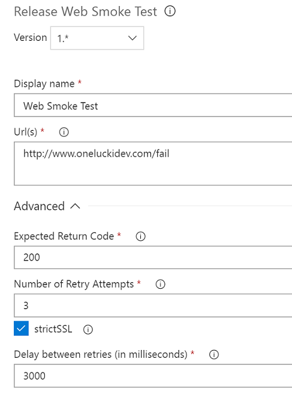

# VSTS Web Release Smoke Test
TFS and VSTS release task to validate that a web app is available and running after in the release.  Written in node, not powershell, so may run on non-windows based build agents.

**For a simple Release Quality Gate / Server Phase Smoke test task, see this: https://marketplace.visualstudio.com/items?itemName=OneLuckiDev.release-gate-smoke-test**

## Functionality
This task will do a http or https Get call on a url, or a list of urls and check that it receives an expected return code.
You may place multiple URLs in a comma separated string in the URL input, this allows you to easily set up a check on multiple individual servers in a server farm when applicable.
You may also Specify a number of retries, so that if a given call fails when first called the task will attempt to retry the call.  This allows for applications where the first call may time out or otherwise fail due to any sort of server "spin up" or other issues, but you don't want to fail the release for those situations.

## Input Value usage
**Url(s)**
 the url or list of URLs to call. The address information should include the protocol desired (http:// or https://).  This may be a list of addresses that are comma separated.
    
    Ex. "http://www.oneluckidev.com"
    
    Ex2. "http://server1/api/healthcheck, http://server2/api/healthcheck, http://server3/api/healthcheck"

**Expected Return Code**
      -- the response code returned by the server that you are expecting. 
    Ex. 200

**Number of Retry Attempts**
     -- the number of attempted retries that the task should go through before failing the task.  
    
    Ex. 3  --- three retries will give a total of four calls the first call, and then three retry attempts
    
    Ex2. 0  --- Zero retries to fail after the first call

## Smoke Test task goals

Simple task to test the availability of a web applicaiton or api after a deployment to verify that there is some expected response.  This allows for a sanity check at the end of the release in to an environment to verify that what was deployed is actually functional.  

## Requirements
Since the task is executed by the build agent, your build machines has to have access to the website you are trying to call.
## Images

## Source
[GitHub](https://github.com/jeffpriz/vsts-release-web-test)

## Issues
[File an issue](https://github.com/jeffpriz/vsts-release-web-test/issues)

## Credits
[Jeff Przylucki](http://www.oneluckidev.com)

Icon - Smoke Detector by Arthur Shlain from the Noun Project
